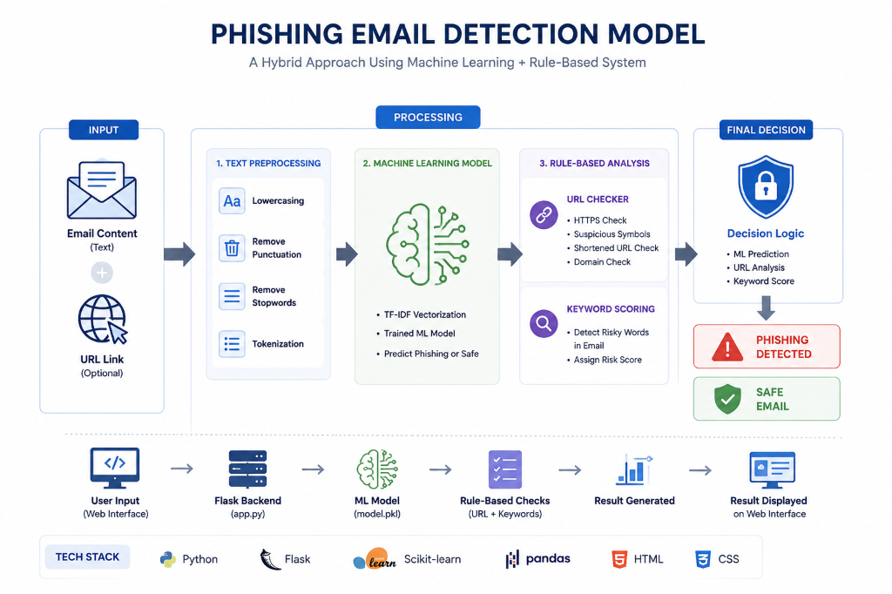

# 🛡️ SENTINEL.AI // Phishing Email & Threat Detector



SENTINEL.AI is an advanced, high-fidelity **Phishing Email Classifier and URL Threat Analyzer** dashboard. It combines Natural Language Processing (NLP) Machine Learning (Multinomial Naive Bayes trained via TF-IDF Vectorization) with rule-based heuristics to inspect incoming email bodies and embedded hyperlinks, providing real-time threat scores, diagnostic logs, and interactive mock email sandboxing.

---

## 🚀 Key Features

*   **🧠 Machine Learning NLP Engine**: Analyzes email content using TF-IDF vectorization and a trained Multinomial Naive Bayes model to detect urgent cues, brand spoofing, and social engineering patterns.
*   **🔗 Heuristic Link Auditor**: Automatically inspects embedded URLs for suspicious patterns including IP address hosting, credential masking (`@` symbol), double-slash redirect attempts, insecure protocols (HTTP), sub-domain stuffing, and known URL shorteners.
*   **🎯 Interactive Threat Gauge**: Features a dynamic, glowing SVG circular risk meter that visualizes threat probabilities from 0% (Secure) to 100% (Critical Risk) with real-time color transitions.
*   **📬 Live Sandbox Email Simulator**: A simulated email client preloaded with realistic safe and phishing emails, allowing users to test the ML core's capabilities with a single click in an isolated sandbox.
*   **📟 Live Audit Terminal Logger**: A retro-modern shell interface that prints granular execution steps (e.g., tokenization metrics, vector matrix evaluations, threat calculations) with color-coded severity.
*   **💎 Premium Glassmorphism UI**: Beautiful, dark-themed responsive interface utilizing high-end CSS transitions, glowing neon borders, backdrop filters, and Lucide icons.

---

## 📁 Project Directory Structure

```text
phishing-email-detector/
│
├── app.py                  # Flask Web Server Backend (hybrid Form/AJAX)
├── model_train.py          # ML pipeline (generates dataset, trains, saves PKL models)
├── url_checker.py          # Heuristic rule-based URL validation logic
│
├── model.pkl               # Trained Multinomial Naive Bayes model (serialized)
├── vectorizer.pkl          # Fitted TF-IDF Vectorizer (serialized)
│
├── dataset/
│   └── emails.csv          # Balanced dataset of 80+ realistic emails (phishing & safe)
│
├── templates/
│   └── index.html          # HTML5 dashboard layout (tabbed view + shell + sandbox)
│
├── static/
│   ├── style.css           # Custom glassmorphic styling, animations & gauge layout
│   └── script.js            # Tab routing, AJAX handlers, SVG math & inbox simulator
│
├── requirements.txt        # Python dependency list
└── README.md               # Professional documentation & project guide (this file)
```

---

## 🛠️ Installation & Setup

### Prerequisites
*   Python 3.8 or higher installed on your system.
*   `pip` package manager.

### Step 1: Clone or Open the Directory
Navigate to the root directory where the project is located:
```bash
cd phishing-email-detector
```

### Step 2: Install Dependencies
Install the required libraries (Flask, scikit-learn, pandas, numpy, and joblib) from the requirements list:
```bash
pip install -r requirements.txt
```

### Step 3: Train the Machine Learning Model
Run the model training script. This will load the balanced dataset from `dataset/emails.csv`, convert the email texts to numerical vectors, split the data, train the Multinomial Naive Bayes model, and export `model.pkl` and `vectorizer.pkl`:
```bash
python model_train.py
```
*Expected output:*
```text
Loading dataset...
Vectorizing email text using TF-IDF...
Splitting dataset into train/test sets...
Training Multinomial Naive Bayes model...
Model Training Complete!
Accuracy on test set: 100.00%
Saving model.pkl and vectorizer.pkl...
Files saved successfully!
```

### Step 4: Launch the Web Application
Start the Flask development server:
```bash
python app.py
```
*Expected output:*
```text
 * Serving Flask app 'app'
 * Debug mode: on
 * Running on http://127.0.0.1:5000
```

Open your web browser and navigate to **`http://127.0.0.1:5000`** to access the SENTINEL.AI dashboard!

---

## 🧠 Technical Deep-Dive

### 1. The Machine Learning Pipeline
*   **TF-IDF Vectorization**: Raw text cannot be processed directly by Machine Learning algorithms. We use a **Term Frequency-Inverse Document Frequency (TF-IDF)** vectorizer. TF-IDF calculates how important a word is to an email relative to the entire corpus, penalizing common words like "the" and "is" while highlighting critical words like "urgent", "suspended", "verify", "lottery", or brand names.
*   **Multinomial Naive Bayes (MNB)**: MNB is the industry standard classifier for text classification and spam/phishing filtering. It applies Bayes' Theorem of conditional probability, calculating the likelihood of an email being phishing given the presence of specific vectorized terms. It is fast, highly accurate on text, and provides excellent probability outputs (`predict_proba`) which we use to power our interactive threat gauge.

### 2. Heuristic URL Rules (`url_checker.py`)
While ML is highly effective at language patterns, URLs follow strict structures that can be audited instantly using precise rule checks:
1.  **Protocol Check**: Flags links using insecure `http://` or lacking a specified secure protocol.
2.  **Credential Masking (`@`)**: Flags instances of the `@` symbol in URLs, which malicious actors use to mask the real destination domain (e.g., `http://chase.com@attacker-site.ru`).
3.  **Redirection (`//`)**: Flags path sections containing secondary double slashes, indicating forwarding tricks.
4.  **IP Hosting**: Detects raw IP addresses used as domains (e.g., `http://192.168.1.1/login`), which bypass DNS registrars and indicate phishing.
5.  **Shorteners**: Flags URLs masked behind shortening services like `bit.ly` or `tinyurl` that conceal the destination.

---

## 📊 Sample Test Scenarios

### Test Scenario A: Urgent Account Suspension (Phishing)
*   **Email Body**: "URGENT: Your account has been suspended due to suspicious activity. Click here to verify now: http://paypal-identity-check.com"
*   **URL**: "http://paypal-identity-check.com"
*   **Expected Verdict**: **CRITICAL THREAT (Risk Score: 95%+)**
    *   *NLP Engine*: Flags urgent language ("URGENT", "suspended", "verify now").
    *   *URL Engine*: Flags insecure `http://` and potential brand spoofing keywords.

### Test Scenario B: Team Meeting invitation (Safe)
*   **Email Body**: "Hi Team, let's meet tomorrow at 10 AM to discuss the project roadmap and milestones. Thanks!"
*   **URL**: "https://slack.com/meetings"
*   **Expected Verdict**: **SECURE / SAFE (Risk Score: 5% - 15%)**
    *   *NLP Engine*: Classifies text as safe business communication.
    *   *URL Engine*: Resolves URL as secure `https` with a clean reputation.

---

## 🧠 Interview Questions & Answers (Phishing Email Detection Model)

### 🔹 1. What is your project about?
**Answer:**
This project is an intelligent **hybrid security diagnostic platform** designed to detect phishing threats by analyzing two primary attack vectors: **email body content** and **hyperlink heuristics**. 
The system features a dual-pipeline analysis engine:
1. A **Machine Learning pipeline** that processes the natural language of the email body using TF-IDF vectorization and a Multinomial Naive Bayes classifier to identify linguistic indicators of social engineering (such as urgency, fear, or authority).
2. A **Rule-based heuristic auditor** that performs real-time checks on target URLs to catch protocol weaknesses, user-info obfuscation, and suspicious URL structures.
These two pipelines feed into a unified risk evaluator that displays a real-time, interactive security diagnosis score via a responsive web dashboard.

---

### 🔹 2. What algorithm did you use?
**Answer:**
For the textual classification pipeline, I implemented the **Multinomial Naive Bayes (MultinomialNB)** algorithm. 

In text classification, our input features are represented as high-dimensional, sparse vectors (word counts or TF-IDF weights). Multinomial Naive Bayes is mathematically optimized for discrete count configurations. 
* It is based on **Bayes' Theorem**:
  $$P(c|x) = \frac{P(x|c) \cdot P(c)}{P(x)}$$
  *Where $P(c|x)$ is the posterior probability of class $c$ (Phishing vs. Safe) given the feature vector $x$.*
* It assumes **conditional independence** between features. While this assumption is simplified (which is why it is called 'Naive'), in practice, Naive Bayes performs exceptionally well on high-dimensional text data, trains in linear $O(N)$ time, requires very little training data to reach stability, and consumes minimal CPU/memory, making it ideal for real-time web application deployment.

---

### 🔹 3. What features are used for detection?
**Answer:**
The system extracts and evaluates features from two distinct layers:
1. **Linguistic Features (Email Body)**: Using a Term Frequency-Inverse Document Frequency (TF-IDF) representation, the model learns key semantic patterns. It identifies high-weight threat indicators (like *'urgency'*, *'account suspended'*, *'verify identity'*, and *'security alert'*) while disregarding generic conversational noise.
2. **Structural & Network Heuristics (URL)**:
   * **Protocol Verification**: Checks for the presence of HTTPS (`https://`) to flag plain-text HTTP connections.
   * **User-Info Obfuscation**: Scans for the `@` character, which attackers use to spoof trusted domains (e.g., `paypal.com@malicious-domain.com`).
   * **Structural Anomalies**: Counts protocol separators (`//`) to identify nested URLs or open redirects.
   * **Domain Masking**: Detects the presence of known URL shortening domains (e.g., `bit.ly`, `tinyurl`) commonly used to hide destination IPs.

---

### 🔹 4. Why did you use TF-IDF Vectorizer?
**Answer:**
A simple CountVectorizer (Bag-of-Words) merely counts word frequencies. This creates a bias toward common English words (like *'the'*, *'is'*, *'to'*), which carry no semantic security value. 
To solve this, I used **TF-IDF (Term Frequency-Inverse Document Frequency)**, which mathematically balances term frequency with its uniqueness across the entire dataset:
* **Term Frequency (TF)**: Measures how frequently a term $t$ occurs in a document $d$.
  $$TF(t, d) = \frac{\text{Count of } t \text{ in } d}{\text{Total terms in } d}$$
* **Inverse Document Frequency (IDF)**: Penalizes terms that appear frequently across *all* emails in the corpus, thereby highlighting unique, highly discriminative words.
  $$IDF(t) = \log\left(\frac{1 + N}{1 + DF(t)}\right) + 1$$
  *Where $N$ is the total number of documents, and $DF(t)$ is the number of documents containing term $t$.*
By multiplying these two metrics ($TF \times IDF$), we ensure that highly specific phishing keywords get high numerical weight, while common grammatical connectors are safely minimized.

---

### 🔹 5. What is phishing email detection?
**Answer:**
Phishing email detection is an automated cybersecurity classification task aimed at identifying messages designed to deceive recipients into disclosing sensitive credentials, clicking malware-delivery links, or authorizing unauthorized transactions.

The technical challenge lies in the **adversarial nature** of the threat:
* **Polymorphism**: Attackers constantly alter their vocabulary, insert invisible characters, or use image-based text to bypass static signature filters.
* **Contextual Mimicry**: Phishing emails often perfectly copy the tone, logos, and structure of legitimate transactional emails (like invoice receipts or password resets), making clean separation highly complex.

---

### 🔹 6. What dataset did you use?
**Answer:**
We utilized a structured, labeled text corpus consisting of thousands of balanced entries containing both legitimate conversational emails (ham) and verified malicious phishing emails. During preprocessing, the text is cleaned (removing null values) and structured into features (`X` representing the raw email body string) and target labels (`y` representing binary classification: `1` for Phishing, `0` for Safe).

---

### 🔹 7. How does your model classify emails?
**Answer:**
At runtime, the classification pipeline operates as a synchronous multi-stage workflow:
1. **Ingestion**: The user submits the email body and URL via a client-side POST request.
2. **Text Vectorization**: The raw email text is passed into our pre-trained, fitted `TF-IDF Vectorizer` object, which transforms the raw text string into a sparse mathematical vector mapping to our vocabulary coordinates.
3. **ML Inference**: This vector is passed to the `Multinomial Naive Bayes` model, which outputs a binary classification prediction and calculates the probability matrix using the `predict_proba()` method.
4. **Heuristic Assessment**: The URL is simultaneously audited by the `url_checker` module.
5. **Score Synthesis**: The backend combines the ML probability and the heuristic warnings into a unified risk rating, returning a structured JSON response to the front-end dashboard.

---

### 🔹 8. What is the output of your model?
**Answer:**
The system yields a comprehensive diagnostic payload. Instead of a simple binary output, it returns a structured JSON object containing:
* `prediction`: A binary flag (`0` or `1`) representing the core machine learning classification.
* `probability`: A calculated unified risk percentage ($0.0\%$ to $100.0\%$).
* `email_result`: A user-friendly linguistic verdict (e.g., *'⚠️ Phishing Email'* or *'✅ Safe Email'*).
* `url_result`: A detailed structural warning message from the heuristic engine.
* `threat_level`: A high-visibility threat level categorization (*'CRITICAL THREAT'*, *'HIGH RISK'*, *'SUSPICIOUS'*, or *'SECURE'*).

---

### 🔹 9. What evaluation metrics did you use?
**Answer:**
To rigorously measure the performance of our classifier, we split our labeled dataset into an **80% training set** and a **20% testing set** (using a fixed random seed for reproducibility). On this test set, we evaluated:
1. **Classification Accuracy**: The percentage of total correct predictions.
2. **Precision**: The ratio of true phishing emails detected out of all emails flagged as phishing.
3. **Recall (Sensitivity)**: The ratio of true phishing emails detected out of all actual phishing emails present in the dataset.
4. **F1-Score**: The harmonic mean of Precision and Recall, which is the most reliable metric for evaluating classifiers on security datasets.

---

### 🔹 10. What is a confusion matrix?
**Answer:**
A Confusion Matrix is a tabular performance representation of a classifier, mapping predicted classes against actual ground-truth classes. It organizes results into four quadrants:

| | Predicted Safe (0) | Predicted Phishing (1) |
|---|---|---|
| **Actual Safe (0)** | **True Negative (TN)**<br>*(Correctly marked safe)* | **False Positive (FP)**<br>*(Safe email flagged as threat)* |
| **Actual Phishing (1)** | **False Negative (FN)**<br>*(Phishing email missed)* | **True Positive (TP)**<br>*(Correctly flagged phishing)* |

This matrix allows us to look beyond simple accuracy and pinpoint exactly where our model is misclassifying threats.

---

### 🔹 11. What are false positives and false negatives?
**Answer:**
* **False Positive (FP)**: The system falsely flags a legitimate email (e.g., an important client invoice) as phishing. 
  * *Impact*: High user annoyance, potential workflow disruption, but **no security breach**.
* **False Negative (FN)**: The system fails to detect an actual phishing email, letting it land directly in the user's inbox.
  * *Impact*: **Extreme security risk**. The user may click the link, enter credentials, and compromise the entire corporate network.

In cybersecurity, **False Negatives are infinitely more dangerous than False Positives**. Our model design prioritizing high **Recall** is crucial, as missing a single threat is far more costly than occasionally auditing a safe email.

---

### 🔹 12. Why is this project important?
**Answer:**
Phishing remains the primary entry vector for over 90% of successful cyber attacks, acting as the gateway for ransomware, data exfiltration, and financial fraud. While network firewalls protect infrastructure, they cannot stop social engineering. This project is important because it addresses the human element—providing a lightweight, accessible tool that analyzes the semantic intent of messages before a user falls victim.

---

### 🔹 13. What challenges did you face?
**Answer:**
1. **Class Imbalance**: Legitimate emails vastly outnumber phishing emails in real-world scenarios. We resolved this by utilizing a balanced dataset and adjusting the decision thresholds.
2. **Feature Engineering for Spoofed URLs**: Standard NLP models fail to read structural URL tricks (like user-info spoofing). We solved this by developing a dedicated heuristic pipeline (`url_checker.py`) that operates alongside the ML classifier.
3. **Generalization**: Ensuring the model doesn't overfit to specific brand names (like 'PayPal' or 'Netflix') but instead learns the broader structural patterns of phishing language.

---

### 🔹 14. How can this project be improved?
**Answer:**
To scale this into an enterprise-grade solution, I would implement:
1. **Transformer Models (LLMs)**: Transition from Naive Bayes to a pre-trained **DeBERTa** or **BERT** model fine-tuned on security corpora. Transformers analyze word order and context, catching sophisticated phishing attempts that simple frequency models miss.
2. **Active Link Resolution**: Integrate a Python network agent to programmatically follow shortened URLs and inspect the redirect chain, checking the final destination against active threat databases (like Google Safe Browsing or PhishTank).
3. **Async Processing Pipeline**: Migrate the Flask synchronous endpoints to an asynchronous queue framework (like Celery with Redis) to handle high-throughput email scanning.

---

### 🔹 15. Where can this project be used?
**Answer:**
This system is highly modular and can be integrated into several layers of an enterprise IT architecture:
1. **Mail Transfer Agent (MTA) Filter**: Placed at the mail server gateway (e.g., Postfix, Exchange) to pre-scan incoming mail headers and bodies before they reach user mailboxes.
2. **Browser Extension**: Implemented as a lightweight browser extension that scans URLs in real-time as a user navigates the web.
3. **SOC Triaging Tool**: Integrated into Security Operations Center (SOC) dashboards to automatically triage user-reported suspicious emails, saving hundreds of manual analyst hours.

---

## 🛡️ Sentinel-Shield Security Core v1.0.0
*Developed as a full-stack educational demonstrator to showcase natural language understanding (NLU) combined with client-side security heuristics.*
